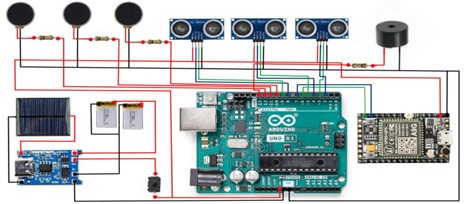
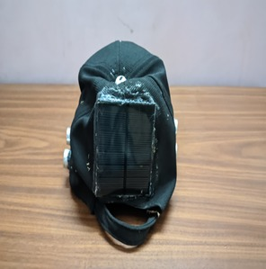
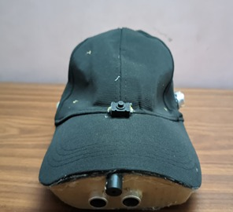

# NETRA- A Smart Cap for Blind People
The Smart Cap is a low-cost wearable device designed to support visually impaired individuals with navigation and safety. It uses ultrasonic sensors to detect nearby obstacles and provides feedback through vibrations or sound alerts, helping users avoid collisions. A built-in GPS module enables real-time location tracking for independent mobility and caregiver support. Powered by an Arduino microcontroller, the cap is lightweight, affordable, and easy to use.

This device not only improves mobility but also instills confidence and independence in daily life. Its simple design ensures accessibility for people of all age groups, while the affordable components make it suitable for large-scale adoption. By combining innovation with practicality, the Smart Cap represents a step forward in assistive technology for the visually impaired.
<h4>Circuit Diagram:</h4>
<table>
  <tr>
    <td>
        
    </td>
  </tr>
</table>

<h4>Some images of our model:</h4>
<table>
  <tr>
    <td>
        
        
    </td>
  </tr>
</table>

References: https://www.researchgate.net/publication/344507436_Ultrasonic_Sensor_based_Smart_Cap_as_Electr-onic_Travel_Aid_for_Blind_People

